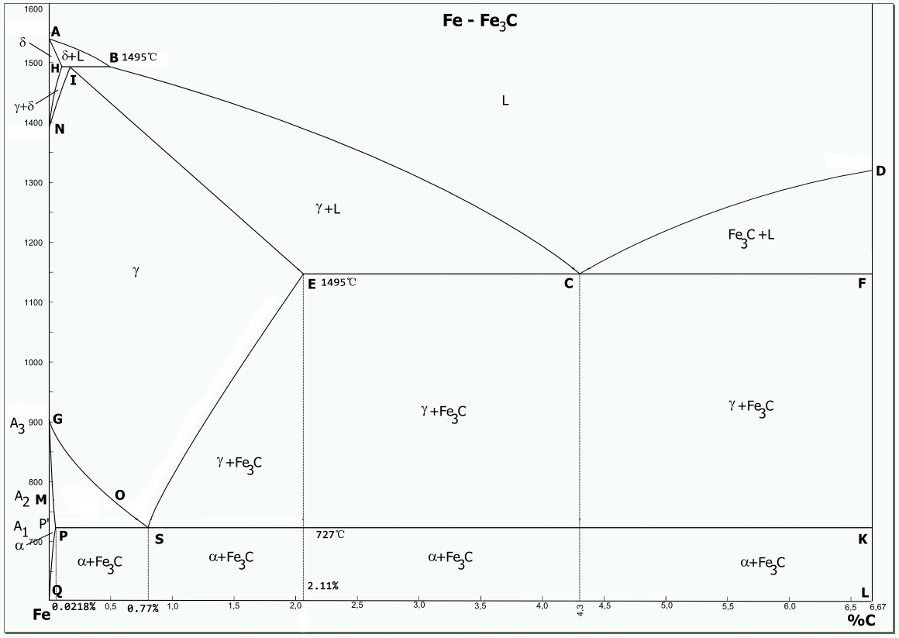

---

layout: post

title: "工程材料学复习笔记"

date: 2018-05-05

excerpt: "金属相图等"

categories: 
	- 学习
	- 期末复习

tag: 
	- 学习
	- 期末复习

math: true
---

# Fe-Fe3C合金相图

## 组元

- **Fe**:
  - 912°C以下，α-Fe，体心立方结构
  - 912°C ~ 1394°C，γ-Fe，面心立方结构
  - 1394°C以上，δ-Fe，体心立方结构
- **Fe3C，渗碳体**：含碳量6.69%
- **C**
- **铁素体**：C在α-Fe中的间隙固溶物，记作α或F
- **奥氏体**：C在γ-Fe中的间隙固溶物，记作γ或A
- **δ相**：C在δ-Fe中的间隙固溶物，记又称为高温铁素体
- **石墨**：游离的碳，记作G
- **液相**：记作L

## 相图

### 相区

- **单相区**
  - L
  - δ
  - γ（A）
  - α（F）
  - Fe3C
- **双相区**
  - L+δ
  - L+γ（A）
  - L+Fe3C
  - δ+γ（A）
  - γ（A）+Fe3C
  - α（F）+Fe3C
  - γ（A）+α（F）
- **三相区**
  - **HIB线**：包晶反应线，L+δ+γ（A），1495°C
  - **ECF线**：共晶反应线，L+γ（A）+Fe3C，1148°C
  - **PSK线**：共析反应线，γ（A）+α（F）+Fe3C，727°C

### 恒温转变

$$
L_{0.53}+\delta_{0.09} \stackrel{1495^{\circ} \mathrm{C}}{\longrightarrow} \gamma_{0.17}
$$

**包晶反应**，其中下标为含碳量。
$$
L_{4.3} \stackrel{1148^{\circ} \mathrm{C}}{\longrightarrow} \gamma_{2.11}+F e_{3} C
$$
**共晶反应**，其产物为***莱氏体***，记为Ld。
$$
\gamma_{0.77} \stackrel{727^{\circ} \mathrm{C}}{\longrightarrow} \alpha_{0.0218}+F e_{3} C
$$
**共析反应**，其产物为***珠光体***，记为P。

### 各点的意义

| 特性点 | 温度/°C | 含碳量/% |            含义            |
| :----: | :-----: | :------: | :------------------------: |
|   A    |  1538   |    0     |          铁的熔点          |
|   B    |  1495   |   0.53   |  包晶反应时液体的组成成分  |
|   C    |  1148   |   4.3    |        ***共晶点***        |
|   D    |  1227   |   6.69   |   Fe3C的熔点    |
|   E    |  1148   |   2.11   |    γ（A）中的最大溶碳量    |
|   F    |  1148   |   6.69   |   Fe3C的成分    |
|   G    |   912   |    0     | α-Fe和γ-Fe的同素异构转变点 |
|   H    |  1495   |   0.09   |   δ固溶体中的最大溶碳量    |
|   I    |  1495   |   0.17   |        ***包晶点***        |
|   K    |   727   |   6.69   |   Fe3C的成分    |
|   N    |  1349   |    0     | δ-Fe和γ-Fe的同素异构转变点 |
|   P    |   727   |  0.0218  |    α（F）中的最大溶碳量    |
|   S    |   727   |   0.77   |        ***共析点***        |
|   Q    |  室温   |  0.0008  |   室温时α（F）中的溶碳量   |

# 钢的冷却曲线

