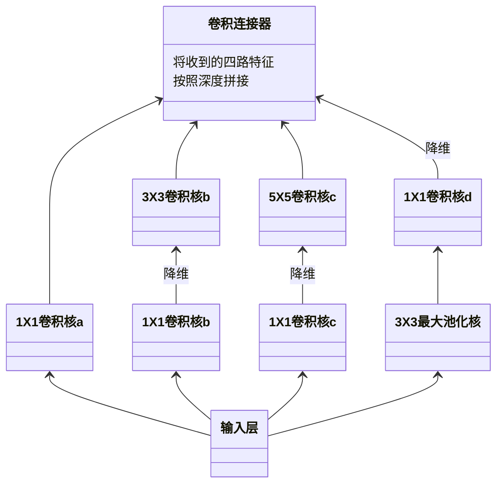
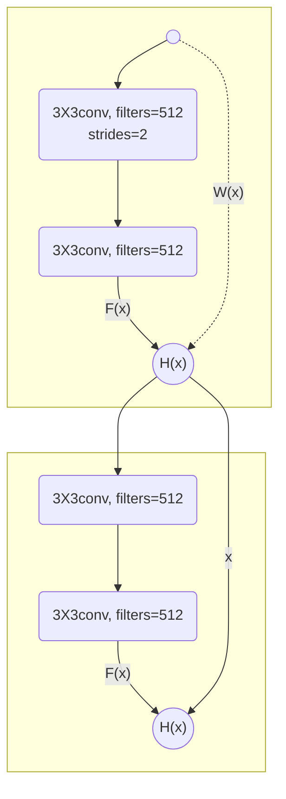

# 几种经典的CNN模型

首先，标准的CNN网络结构模型一般包括：

- 卷积层
- 批标准化
- 激活函数
- 池化
- dropout，休眠一定比例的神经元


## 1、LeNet

共5层，包括两层卷积计算和三层全连接

- 第一层卷积计算
  - 6个5*5卷积核，卷积步长为1，不使用全零填充
  - 无批标准化
  - 激活函数使用sigmoid
  - 最大池化，池化核尺寸2*2，步长为2，不使用全零填充
  - 无dropout
- 第二层卷积计算
  - 16个5*5卷积核，卷积步长为1，不使用全零填充
  - 无批标准化
  - 激活函数使用sigmoid
  - 最大池化，池化核尺寸2*2，步长为2，不使用全零填充
  - 无dropout
- fatten
- 全连接网络，120个神经元，使用sigmoid激活函数
- 全连接网络，84个神经元，使用sigmoid激活函数
- 全连接网络，10个神经元，使用softmax激活函数

```python
class BaseModel(Model):
    def __init__(self):
        super(BaseModel, self).__init__()
        # 卷积（特征提取）
        # C:卷积层--6个卷积核，每个尺寸为5*5
        self.c1 = Conv2D(filters=6, kernel_size=(5, 5), padding='valid')  
        # A:激活层--激活
        self.a1 = Activation(tf.keras.activations.sigmoid)  
        # P: 池化层--最大池化，尺寸2*2，步长2
        self.p1 = MaxPool2D(pool_size=(2, 2), strides=2, padding='valid')  

        self.c2 = Conv2D(filters=6, kernel_size=(5, 5), padding='valid')
        self.a2 = Activation(tf.keras.activations.sigmoid)
        self.p2 = MaxPool2D(pool_size=(2, 2), strides=2, padding='valid')

        self.flatten = Flatten()
        self.f1 = Dense(120, activation=tf.keras.activations.sigmoid)
        self.f2 = Dense(84, activation=tf.keras.activations.sigmoid)
        self.f3 = Dense(10, activation=tf.keras.activations.softmax)

    def call(self, inputs, training=None, mask=None):
        inputs = self.c1(inputs)
        inputs = self.a1(inputs)
        inputs = self.p1(inputs)

        inputs = self.c2(inputs)
        inputs = self.a2(inputs)
        inputs = self.p2(inputs)

        inputs = self.flatten(inputs)
        inputs = self.f1(inputs)
        inputs = self.f2(inputs)
        outputs = self.f3(inputs)

        return outputs
```


## 2、AlexNet

共8层，包括五层卷积计算和三层全连接

- 第一层卷积计算
  - 96个3*3卷积核，卷积步长为1，不使用全零填充
  - 使用局部相应标准化LRN
  - 激活函数使用relu
  - 最大池化，池化核尺寸3*3，步长为2
  - 无dropout
- 第二层卷积计算
  - 256个3*3卷积核，卷积步长为1，不使用全零填充
  - 使用局部相应标准化LRN
  - 激活函数使用relu
  - 最大池化，池化核尺寸3*3，步长为2
  - 无dropout
- 第三层卷积计算
  - 384个3*3卷积核，卷积步长为1，**使用**全零填充
  - 无标准化
  - 激活函数使用relu
  - 不使用池化
  - 无dropout
- 第四层卷积计算与第三层相同
  - 384个3*3卷积核，卷积步长为1，**使用**全零填充
  - 无标准化
  - 激活函数使用relu
  - 不使用池化
  - 无dropout
- 第五层卷积计算
  - 256个3*3卷积核，卷积步长为1，**使用**全零填充
  - 无标准化
  - 激活函数使用relu
  - 最大池化，池化核尺寸3*3，步长为2
  - 无dropout
- fatten
- 全连接网络，2048个神经元，使用relu激活函数，50% dropout
- 全连接网络，2048个神经元，使用relu激活函数，50% dropout
- 全连接网络，10个神经元，使用softmax激活函数

```python
class BaseModel(Model):
    def __init__(self):
        super(BaseModel, self).__init__()
        self.c1 = Conv2D(filters=96, kernel_size=(3, 3), padding='valid')
        self.b1 = BatchNormalization()
        self.a1 = Activation(tf.keras.activations.relu)
        self.p1 = MaxPool2D(pool_size=(3, 3), strides=2)

        self.c2 = Conv2D(filters=256, kernel_size=(3, 3), padding='valid')
        self.b2 = BatchNormalization()
        self.a2 = Activation(tf.keras.activations.relu)
        self.p2 = MaxPool2D(pool_size=(3, 3), strides=2)

        self.c3 = Conv2D(filters=384, kernel_size=(3, 3), padding='same')
        self.a3 = Activation(tf.keras.activations.relu)

        self.c4 = Conv2D(filters=384, kernel_size=(3, 3), padding='same')
        self.a4 = Activation(tf.keras.activations.relu)

        self.c5 = Conv2D(filters=256, kernel_size=(3, 3), padding='same')
        self.a5 = Activation(tf.keras.activations.relu)
        self.p5 = MaxPool2D(pool_size=(3, 3), strides=2)

        self.flatten = Flatten()
        self.f1 = Dense(2048, activation=tf.keras.activations.relu)
        self.d1 = Dropout(0.5)
        self.f2 = Dense(2048, activation=tf.keras.activations.relu)
        self.d2 = Dropout(0.5)
        self.f3 = Dense(10, activation=tf.keras.activations.softmax)

    def call(self, inputs, training=None, mask=None):
        inputs = self.c1(inputs)
        inputs = self.b1(inputs)
        inputs = self.a1(inputs)
        inputs = self.p1(inputs)

        inputs = self.c2(inputs)
        inputs = self.b2(inputs)
        inputs = self.a2(inputs)
        inputs = self.p2(inputs)

        inputs = self.c3(inputs)
        inputs = self.a3(inputs)

        inputs = self.c4(inputs)
        inputs = self.a4(inputs)

        inputs = self.c5(inputs)
        inputs = self.a5(inputs)
        inputs = self.p5(inputs)

        inputs = self.flatten(inputs)
        inputs = self.f1(inputs)
        inputs = self.d1(inputs)
        inputs = self.f2(inputs)
        inputs = self.d2(inputs)
        outputs = self.f3(inputs)

        return outputs
```


## 3、VGGNet

共16层，包括13层卷积计算及三层全连接

### 1、卷积计算层

| 层数 |                  卷积层                   | 批标准化 | 激活层 |                池化层                | dropout |
| :--: | :---------------------------------------: | :------: | :----: | :----------------------------------: | :-----: |
|  1   | 64个卷积核，尺寸为3*3，步长为1，全零填充  |  BN操作  |  relu  |                  无                  |   无    |
|  2   | 64个卷积核，尺寸为3*3，步长为1，全零填充  |  BN操作  |  relu  | 最大池化，池化核尺寸2*2，池化步长为2 |   0.2   |
|  3   | 128个卷积核，尺寸为3*3，步长为1，全零填充 |  BN操作  |  relu  |                  无                  |   无    |
|  4   | 128个卷积核，尺寸为3*3，步长为1，全零填充 |  BN操作  |  relu  | 最大池化，池化核尺寸2*2，池化步长为2 |   0.2   |
|  5   | 256个卷积核，尺寸为3*3，步长为1，全零填充 |  BN操作  |  relu  |                  无                  |   无    |
|  6   | 256个卷积核，尺寸为3*3，步长为1，全零填充 |  BN操作  |  relu  |                  无                  |   无    |
|  7   | 256个卷积核，尺寸为3*3，步长为1，全零填充 |  BN操作  |  relu  | 最大池化，池化核尺寸2*2，池化步长为2 |   0.2   |
|  8   | 512个卷积核，尺寸为3*3，步长为1，全零填充 |  BN操作  |  relu  |                  无                  |   无    |
|  9   | 512个卷积核，尺寸为3*3，步长为1，全零填充 |  BN操作  |  relu  |                  无                  |   无    |
|  10  | 512个卷积核，尺寸为3*3，步长为1，全零填充 |  BN操作  |  relu  | 最大池化，池化核尺寸2*2，池化步长为2 |   0.2   |
|  11  | 512个卷积核，尺寸为3*3，步长为1，全零填充 |  BN操作  |  relu  |                  无                  |   无    |
|  12  | 512个卷积核，尺寸为3*3，步长为1，全零填充 |  BN操作  |  relu  |                  无                  |   无    |
|  13  | 512个卷积核，尺寸为3*3，步长为1，全零填充 |  BN操作  |  relu  | 最大池化，池化核尺寸2*2，池化步长为2 |   0.2   |

### 2、全连接层

- fatten
- 全连接网络，512个神经元，使用relu激活函数，20% dropout
- 全连接网络，512个神经元，使用relu激活函数，20% dropout
- 全连接网络，10个神经元，使用softmax激活函数

```python
    def __init__(self):
        super(BaseModel, self).__init__()
        self.c1 = Conv2D(filters=64, kernel_size=(3, 3), padding='same')
        self.b1 = BatchNormalization()
        self.a1 = Activation('relu')

        self.c2 = Conv2D(filters=64, kernel_size=(3, 3), padding='same')
        self.b2 = BatchNormalization()
        self.a2 = Activation('relu')
        self.p2 = MaxPool2D(pool_size=(2, 2), strides=2, padding='same')
        self.d2 = Dropout(0.2)

        self.c3 = Conv2D(filters=128, kernel_size=(3, 3), padding='same')
        self.b3 = BatchNormalization()
        self.a3 = Activation('relu')

        self.c4 = Conv2D(filters=128, kernel_size=(3, 3), padding='same')
        self.b4 = BatchNormalization()
        self.a4 = Activation('relu')
        self.p4 = MaxPool2D(pool_size=(2, 2), strides=2, padding='same')
        self.d4 = Dropout(0.2)

        self.c5 = Conv2D(filters=256, kernel_size=(3, 3), padding='same')
        self.b5 = BatchNormalization()
        self.a5 = Activation('relu')

        self.c6 = Conv2D(filters=256, kernel_size=(3, 3), padding='same')
        self.b6 = BatchNormalization()
        self.a6 = Activation('relu')

        self.c7 = Conv2D(filters=256, kernel_size=(3, 3), padding='same')
        self.b7 = BatchNormalization()
        self.a7 = Activation('relu')
        self.p7 = MaxPool2D(pool_size=(2, 2), strides=2, padding='same')
        self.d7 = Dropout(0.2)

        self.c8 = Conv2D(filters=512, kernel_size=(3, 3), padding='same')
        self.b8 = BatchNormalization()
        self.a8 = Activation('relu')

        self.c9 = Conv2D(filters=512, kernel_size=(3, 3), padding='same')
        self.b9 = BatchNormalization()
        self.a9 = Activation('relu')

        self.c10 = Conv2D(filters=512, kernel_size=(3, 3), padding='same')
        self.b10 = BatchNormalization()
        self.a10 = Activation('relu')
        self.p10 = MaxPool2D(pool_size=(2, 2), strides=2, padding='same')
        self.d10 = Dropout(0.2)

        self.c11 = Conv2D(filters=512, kernel_size=(3, 3), padding='same')
        self.b11 = BatchNormalization()
        self.a11 = Activation('relu')

        self.c12 = Conv2D(filters=512, kernel_size=(3, 3), padding='same')
        self.b12 = BatchNormalization()
        self.a12 = Activation('relu')

        self.c13 = Conv2D(filters=512, kernel_size=(3, 3), padding='same')
        self.b13 = BatchNormalization()
        self.a13 = Activation('relu')
        self.p13 = MaxPool2D(pool_size=(2, 2), strides=2, padding='same')
        self.d13 = Dropout(0.2)

        self.flatten = Flatten()
        self.fa = Dense(512, activation=tf.keras.activations.relu)
        self.da = Dropout(0.2)
        self.fb = Dense(512, activation=tf.keras.activations.relu)
        self.db = Dropout(0.2)
        self.fc = Dense(10, activation=tf.keras.activations.softmax)

    def call(self, inputs, training=None, mask=None):
        inputs = self.c1(inputs)
        inputs = self.b1(inputs)
        inputs = self.a1(inputs)

        inputs = self.c2(inputs)
        inputs = self.b2(inputs)
        inputs = self.a2(inputs)
        inputs = self.p2(inputs)
        inputs = self.d2(inputs)

        inputs = self.c3(inputs)
        inputs = self.b3(inputs)
        inputs = self.a3(inputs)

        inputs = self.c4(inputs)
        inputs = self.b4(inputs)
        inputs = self.a4(inputs)
        inputs = self.p4(inputs)
        inputs = self.d4(inputs)

        inputs = self.c5(inputs)
        inputs = self.b5(inputs)
        inputs = self.a5(inputs)

        inputs = self.c6(inputs)
        inputs = self.b6(inputs)
        inputs = self.a6(inputs)

        inputs = self.c7(inputs)
        inputs = self.b7(inputs)
        inputs = self.a7(inputs)
        inputs = self.p7(inputs)
        inputs = self.d7(inputs)

        inputs = self.c8(inputs)
        inputs = self.b8(inputs)
        inputs = self.a8(inputs)

        inputs = self.c9(inputs)
        inputs = self.b9(inputs)
        inputs = self.a9(inputs)

        inputs = self.c10(inputs)
        inputs = self.b10(inputs)
        inputs = self.a10(inputs)
        inputs = self.p10(inputs)
        inputs = self.d10(inputs)

        inputs = self.c11(inputs)
        inputs = self.b11(inputs)
        inputs = self.a11(inputs)

        inputs = self.c12(inputs)
        inputs = self.b12(inputs)
        inputs = self.a12(inputs)

        inputs = self.c13(inputs)
        inputs = self.b13(inputs)
        inputs = self.a13(inputs)
        inputs = self.p13(inputs)
        inputs = self.d13(inputs)

        inputs = self.flatten(inputs)
        inputs = self.fa(inputs)
        inputs = self.da(inputs)
        inputs = self.fb(inputs)
        inputs = self.db(inputs)
        outputs = self.fc(inputs)

        return outputs
```


## 4、InceptionNet

主体结构为Inception结构块，结构如下图所示：





|    卷积核     |                    卷积层                     | 批标准化 | 激活层 |                       池化层                        | dropout |
| :-----------: | :-------------------------------------------: | :------: | :----: | :-------------------------------------------------: | :-----: |
|  1X1卷积核a   | 16个卷积核，尺寸为1*1，<br/>步长为1，全零填充 |  BN操作  |  relu  |                         无                          |   无    |
|  1X1卷积核b   | 16个卷积核，尺寸为1*1，<br/>步长为1，全零填充 |  BN操作  |  relu  |                         无                          |   无    |
|  3X3卷积核b   | 16个卷积核，尺寸为3*3，<br/>步长为1，全零填充 |  BN操作  |  relu  |                         无                          |   无    |
|  1X1卷积核c   | 16个卷积核，尺寸为1*1，<br/>步长为1，全零填充 |  BN操作  |  relu  |                         无                          |   无    |
|  5X5卷积核c   | 16个卷积核，尺寸为5*5，<br/>步长为1，全零填充 |  BN操作  |  relu  |                         无                          |   无    |
| 3X3最大池化核 |                      无                       |    无    |   无   | 最大池化，池化核尺寸3*3，<br/>池化步长为1，全零填充 |   无    |
|  1X1卷积核d   | 16个卷积核，尺寸为1*1，<br/>步长为1，全零填充 |  BN操作  |  relu  |                         无                          |   无    |

神经网络结构范例如下所示，包括四个Inception结构块，两两一组，分为block_0和block_1

```mermaid
graph TB
id1(3*3 conv, filters=16)
style id1 fill: #3991B620, stroke: #3991B6, stroke-width:2px
id2_1(Filter concatenation)
id2_2(1*1 conv)
id2_3(1*1 conv)
id2_4(3*3 conv)
id2_5(1*1 conv)
id2_6(5*5 conv)
id2_7(1*1 conv)
id2_8(3*3 pooling)
id2_9(Previous layer)
style id2_1 fill: #B9CF9320, stroke: #B9CF93, stroke-width:2px
style id2_9 fill: #B9CF9320, stroke: #B9CF93, stroke-width:2px
style id2_2 fill: #3991B620, stroke: #3991B6, stroke-width:2px
style id2_4 fill: #3991B620, stroke: #3991B6, stroke-width:2px
style id2_6 fill: #3991B620, stroke: #3991B6, stroke-width:2px
style id2_3 fill: #FFFF6940, stroke: #FFFF69, stroke-width:2px
style id2_5 fill: #FFFF6940, stroke: #FFFF69, stroke-width:2px
style id2_7 fill: #FFFF6940, stroke: #FFFF69, stroke-width:2px
style id2_8 fill: #CFA3A420, stroke: #CFA3A4, stroke-width:2px
id3_1(Filter concatenation)
id3_2(1*1 conv)
id3_3(1*1 conv)
id3_4(3*3 conv)
id3_5(1*1 conv)
id3_6(5*5 conv)
id3_7(1*1 conv)
id3_8(3*3 pooling)
id3_9(Previous layer)
style id3_1 fill: #B9CF9320, stroke: #B9CF93, stroke-width:2px
style id3_9 fill: #B9CF9320, stroke: #B9CF93, stroke-width:2px
style id3_2 fill: #3991B620, stroke: #3991B6, stroke-width:2px
style id3_4 fill: #3991B620, stroke: #3991B6, stroke-width:2px
style id3_6 fill: #3991B620, stroke: #3991B6, stroke-width:2px
style id3_3 fill: #FFFF6940, stroke: #FFFF69, stroke-width:2px
style id3_5 fill: #FFFF6940, stroke: #FFFF69, stroke-width:2px
style id3_7 fill: #FFFF6940, stroke: #FFFF69, stroke-width:2px
style id3_8 fill: #CFA3A420, stroke: #CFA3A4, stroke-width:2px
subgraph block_0
id2_9 --> id2_2
id2_2 --> id2_1
id2_9 --> id2_3
id2_3 --> id2_4
id2_4 --> id2_1
id2_9 --> id2_5
id2_5 --> id2_6
id2_6 --> id2_1
id2_9 --> id2_8
id2_8 --> id2_7
id2_7 --> id2_1
id3_9 --> id3_2
id3_2 --> id3_1
id3_9 --> id3_3
id3_3 --> id3_4
id3_4 --> id3_1
id3_9 --> id3_5
id3_5 --> id3_6
id3_6 --> id3_1
id3_9 --> id3_8
id3_8 --> id3_7
id3_7 --> id3_1
id2_1 --> id3_9
end
id4_1(Filter concatenation)
id4_2(1*1 conv)
id4_3(1*1 conv)
id4_4(3*3 conv)
id4_5(1*1 conv)
id4_6(5*5 conv)
id4_7(1*1 conv)
id4_8(3*3 pooling)
id4_9(Previous layer)
style id4_1 fill: #B9CF9320, stroke: #B9CF93, stroke-width:2px
style id4_9 fill: #B9CF9320, stroke: #B9CF93, stroke-width:2px
style id4_2 fill: #3991B620, stroke: #3991B6, stroke-width:2px
style id4_4 fill: #3991B620, stroke: #3991B6, stroke-width:2px
style id4_6 fill: #3991B620, stroke: #3991B6, stroke-width:2px
style id4_3 fill: #FFFF6940, stroke: #FFFF69, stroke-width:2px
style id4_5 fill: #FFFF6940, stroke: #FFFF69, stroke-width:2px
style id4_7 fill: #FFFF6940, stroke: #FFFF69, stroke-width:2px
style id4_8 fill: #CFA3A420, stroke: #CFA3A4, stroke-width:2px
id5_1(Filter concatenation)
id5_2(1*1 conv)
id5_3(1*1 conv)
id5_4(3*3 conv)
id5_5(1*1 conv)
id5_6(5*5 conv)
id5_7(1*1 conv)
id5_8(3*3 pooling)
id5_9(Previous layer)
style id5_1 fill: #B9CF9320, stroke: #B9CF93, stroke-width:2px
style id5_9 fill: #B9CF9320, stroke: #B9CF93, stroke-width:2px
style id5_2 fill: #3991B620, stroke: #3991B6, stroke-width:2px
style id5_4 fill: #3991B620, stroke: #3991B6, stroke-width:2px
style id5_6 fill: #3991B620, stroke: #3991B6, stroke-width:2px
style id5_3 fill: #FFFF6940, stroke: #FFFF69, stroke-width:2px
style id5_5 fill: #FFFF6940, stroke: #FFFF69, stroke-width:2px
style id5_7 fill: #FFFF6940, stroke: #FFFF69, stroke-width:2px
style id5_8 fill: #CFA3A420, stroke: #CFA3A4, stroke-width:2px
subgraph block_1
id4_9 --> id4_2
id4_2 --> id4_1
id4_9 --> id4_3
id4_3 --> id4_4
id4_4 --> id4_1
id4_9 --> id4_5
id4_5 --> id4_6
id4_6 --> id4_1
id4_9 --> id4_8
id4_8 --> id4_7
id4_7 --> id4_1
id5_9 --> id5_2
id5_2 --> id5_1
id5_9 --> id5_3
id5_3 --> id5_4
id5_4 --> id5_1
id5_9 --> id5_5
id5_5 --> id5_6
id5_6 --> id5_1
id5_9 --> id5_8
id5_8 --> id5_7
id5_7 --> id5_1
id4_1 --> id5_9
end
id1 --> id2_9
id3_1 --> id4_9
id6(global avgpool)
style id6 fill: #CFA3A420, stroke: #CFA3A4, stroke-width:2px
id7(Dense 10)
style id7 fill: #B9CF9320, stroke: #B9CF93, stroke-width:2px
id5_1 --> id6
id6 --> id7
```




```python
class ConvBNRelu(Model):
    def __init__(self, ch, kernel_size=3, strides=1, padding='same'):
        super(ConvBNRelu, self).__init__()
        self.modle = tf.keras.models.Sequential([
            Conv2D(ch, kernel_size, strides=strides, padding=padding),
            BatchNormalization(),
            Activation('relu')
        ])

    def call(self, inputs, **kwargs):
        outputs = self.modle(inputs, training=False)

        return outputs


class InceptionBlock(Model):
    def __init__(self, ch, strides=1):
        super(InceptionBlock, self).__init__()
        self.ch = ch
        self.strides = strides
        self.c1 = ConvBNRelu(ch, kernel_size=1, strides=strides)
        self.c2_1 = ConvBNRelu(ch, kernel_size=1, strides=strides)
        self.c2_2 = ConvBNRelu(ch, kernel_size=3, strides=1)
        self.c3_1 = ConvBNRelu(ch, kernel_size=1, strides=strides)
        self.c3_2 = ConvBNRelu(ch, kernel_size=5, strides=1)
        self.P4_1 = MaxPool2D(2, strides=1, padding='same')
        self.c4_2 = ConvBNRelu(ch, kernel_size=1, strides=strides)

    def call(self, inputs, training=None, mask=None):
        inputs1 = self.c1(inputs)
        inputs2_1 = self.c2_1(inputs)
        inputs2_2 = self.c2_2(inputs2_1)
        inputs3_1 = self.c3_1(inputs)
        inputs3_2 = self.c3_2(inputs3_1)
        inputs4_1 = self.P4_1(inputs)
        inputs4_2 = self.c4_2(inputs4_1)

         # 沿深度方向堆叠
        outputs = tf.concat([inputs1, inputs2_2, inputs3_2, inputs4_2], axis=3) 

        return outputs


class Inception10(Model):
    def __init__(self, num_blocks, num_classes, init_ch=16, **kwargs):
        super(Inception10, self).__init__(**kwargs)
        self.in_channels = init_ch
        self.out_channels = init_ch
        self.num_blocks = num_blocks
        self.init_ch = init_ch
        self.c1 = ConvBNRelu(init_ch)
        self.blocks = tf.keras.models.Sequential()
        for block_id in range(num_blocks):
            for layer_id in range(2):
                if layer_id == 0:
                    block = InceptionBlock(self.out_channels, strides=2)
                else:
                    block = InceptionBlock(self.out_channels, strides=1)
                self.blocks.add(block)

            self.out_channels *= 2
        self.p1 = GlobalAveragePooling2D()
        self.f1 = Dense(num_classes, activation='softmax')

    def call(self, inputs, **kwargs):
        inputs = self.c1(inputs)
        inputs = self.blocks(inputs)
        inputs = self.p1(inputs)
        outputs = self.f1(inputs)

        return outputs
```


## 5、ResNet

将前面的输出特征结果越过对叠层直接传递到后面，并与堆叠卷积的非线性输出叠加，有效的缓解了神经网络模型堆叠导致的退化




其中，虚线表示维度不同时，此时H(x)=F(x)+W(x)，其中W(x)是1*1卷积操作，用于调整x的维度

实线表示维度相同时，此时H(x)=F(x)+x

```python
class ResnetBlock(Model):

    def __init__(self, filters, strides=1, residual_path=False):
        super(ResnetBlock, self).__init__()
        self.filters = filters
        self.strides = strides
        self.residual_path = residual_path

        self.c1 = Conv2D(filters, (3, 3), strides=strides, padding='same', use_bias=False)
        self.b1 = BatchNormalization()
        self.a1 = Activation('relu')

        self.c2 = Conv2D(filters, (3, 3), strides=1, padding='same', use_bias=False)
        self.b2 = BatchNormalization()

        # residual_path为True时，对输入进行下采样，即用1x1的卷积核做卷积操作，保证x能和F(x)维度相同，顺利相加
        if residual_path:
            self.down_c1 = Conv2D(filters, (1, 1), strides=strides, padding='same', use_bias=False)
            self.down_b1 = BatchNormalization()

        self.a2 = Activation('relu')

    def call(self, inputs, **kwargs):
        # residual等于输入值本身，即residual=x
        residual = inputs

        # 将输入通过卷积、BN层、激活层，计算F(x)
        x = self.c1(inputs)
        x = self.b1(x)
        x = self.a1(x)

        x = self.c2(x)
        y = self.b2(x)

        if self.residual_path:
            residual = self.down_c1(inputs)
            residual = self.down_b1(residual)

        # 最后输出的是两部分的和，即F(x)+x或F(x)+Wx,再过激活函数
        out = self.a2(y + residual)
        return out


class ResNet18(Model):
    # block_list表示每个block有几个卷积层
    def __init__(self, block_list, initial_filters=64):
        super(ResNet18, self).__init__()
        # 共有几个block
        self.num_blocks = len(block_list)
        self.block_list = block_list
        self.out_filters = initial_filters
        self.c1 = Conv2D(self.out_filters, (3, 3), strides=1, padding='same', use_bias=False)
        self.b1 = BatchNormalization()
        self.a1 = Activation('relu')
        self.blocks = tf.keras.models.Sequential()
        # 构建ResNet网络结构
        # 第几个resnet block
        for block_id in range(len(block_list)):
            # 第几个卷积层
            for layer_id in range(block_list[block_id]):
                # 对除第一个block以外的每个block的输入进行下采样
                if block_id != 0 and layer_id == 0:
                    block = ResnetBlock(self.out_filters, strides=2, residual_path=True)
                else:
                    block = ResnetBlock(self.out_filters, residual_path=False)
                # 将构建好的block加入resnet
                self.blocks.add(block)
            # 下一个block的卷积核数是上一个block的2倍
            self.out_filters *= 2
        self.p1 = GlobalAveragePooling2D()
        self.f1 = Dense(10, activation='softmax', kernel_regularizer=tf.keras.regularizers.l2())

    def call(self, inputs, **kwargs):
        x = self.c1(inputs)
        x = self.b1(x)
        x = self.a1(x)
        x = self.blocks(x)
        x = self.p1(x)
        y = self.f1(x)
        return y
```


