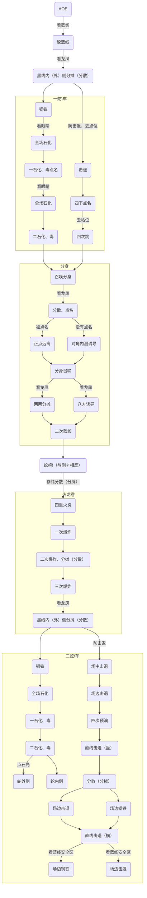

---

layout: post

title: "P8S时间轴"

date: 2023-11-10 18:08:40	

updated: 2023-11-10 18:08:40	

excerpt: "本体门神时间轴"

mermaid: true

categories: 
	- 日常
	- 游戏
	- FF14

tag: 
	- 日常
	- 游戏
	- FF14

typora-root-url: ..
---

# 一、门神

